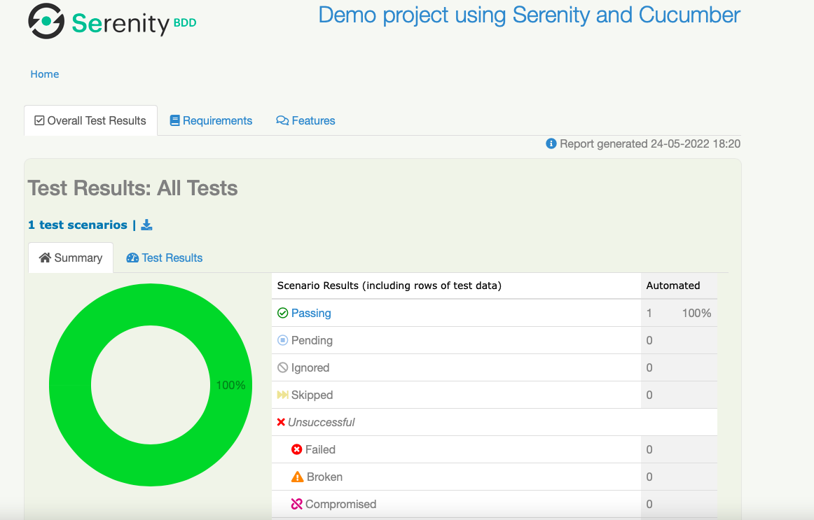
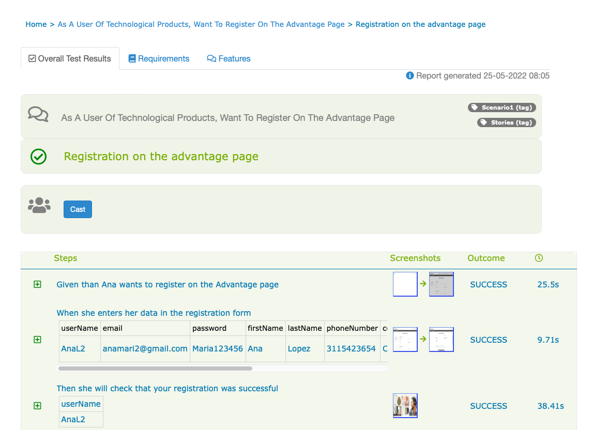

# advantage-screenplay
Automatizacion en screenplay de la web Advantagedemo para proceso de selección en SQA

## Antes de Ejecutar
- Es necesario tener en cuenta que este proyecto fue ejecutado con con
  chromedriver para mac.

    - Si su sistema operativo es diferente debe modificar en el archivo serenity.properties

      > webdriver.chrome.driver = src/test/resources/driver/chromedriver y
      > cambiarlo por el driver que se ajuste a nuestro sistema operativo.

    - Recuerda que el archivo del driver debe ir en la ruta:

      > src/test/resources/driver

## Como Descargar el Proyecto

-  Para descargar el codigo fuente del proyecto es necesario ejecutar el
   comando:

   > git clone https://github.com/pattyvillaj/automatizacionUtest.git

## Resultado Ejecución Automatización

